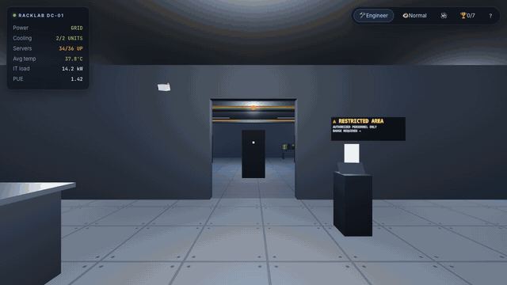

<div align="center">

# 🖥️ RackLab

### An interactive 3D data-center playground for the browser

Walk through a working data center in first person. Open the racks, break the
cooling, cut the power, and chase a web request at the speed of light — and
learn how the cloud physically works along the way.

**No backend. No install beyond `npm`. The whole simulation runs in your browser.**

### ▶︎ [**Play it live**](https://shreyas463.github.io/rackLAB/)

`Vite` · `React` · `TypeScript` · `Three.js` · `React Three Fiber` · `Zustand`

<br>



<sub>Walking the server hall, then flipping to thermal view — the racks glow by
temperature and the NOC dashboards track the heat in real time.</sub>

</div>

---

## ▶ Quick start

```bash
npm install
npm run dev        # → http://localhost:5180
```

```bash
npm run build      # type-check + production bundle into dist/
npm test           # run the simulation unit tests (Vitest)
```

## 🎮 Controls

| Action | Keys |
| --- | --- |
| Move | `W` `A` `S` `D` or arrow keys |
| Look | mouse |
| Run | hold `Shift` |
| Interact | `click` or `E` (aim the crosshair at anything with a label) |
| Thermal view | `T` |
| Mute | `M` |
| Release mouse | `Esc` |

**First stop:** grab a visitor badge at the glowing lobby kiosk — it unlocks the
security door into the server hall.

## ✨ What's inside

A single, highly-polished server hall plus a security lobby, everything driven
by a live cause-and-effect simulation rather than being decorative:

- **Explore in first person** — a lobby with badge-gated security doors, then a
  server hall with hot/cold aisles, overhead cable trays, and ambient lighting.
- **6 openable racks · 36 simulated servers** — swing the glass doors open,
  inspect individual servers (live temp, workload, IP, power draw), power them
  on/off, or repair a failed one. One rack is a **GPU/AI rack** — hotter and far
  more power-hungry, just like the real thing.
- **Thermal view** (`T`) — the room recolors by temperature; cold aisles glow
  blue, stressed racks glow red.
- **Live power chain** — cut the utility grid and the **UPS** batteries carry the
  servers (but *not* the cooling), so temperatures climb until you start the
  **diesel generator** — which needs 8 seconds to stabilize. Miss the window and
  the batteries run dry.
- **Follow a Request** — trigger it at the network cabinet and watch a glowing
  packet travel from the fiber uplink → firewall → load balancer → web server →
  storage and back, narrated step by step with play/pause/replay and speed control.
- **Beginner / Engineer modes** — flip every info card between plain-English
  explanations (+ a fun fact) and real specs (IPs, PUE, kW, redundancy).
- **Missions**
  - *The Overheating Rack* — a CRAC unit fails; diagnose it in thermal view and
    restore cooling before servers thermally shut down.
  - *Right-Size the Facility* — the power bill is out of control; consolidate
    workloads and shut down the GPU/AI rack to get facility power under target
    **without** dropping below a minimum service level.
- **Sandbox experiments** — cut grid power, fail a cooling unit, max out a server
  with an "AI training job," and watch the consequences ripple through temps,
  alerts, alarms, and the NOC dashboards.
- **Procedural audio** — server-room hum, interaction blips, door whooshes, and a
  two-tone alarm, all synthesized with the Web Audio API (no audio files).
- **Achievements + live NOC** — a monitoring desk renders real-time temperature,
  alert, and power/PUE dashboards onto its screens.

## 🏛️ Architecture

The design goal was a clean separation between the **simulation** (pure,
testable), the **state/orchestration** (Zustand), and the **presentation**
(React Three Fiber + a React HUD).

```
src/
├── sim/
│   ├── model.ts        # PURE simulation: thermal model, power chain, PUE.
│   │                   #   No React/Three/DOM — just input→output functions.
│   └── model.test.ts   # 27 Vitest unit tests over that model.
├── store.ts            # Zustand store: world state + a fixed-timestep tick()
│                       #   that calls the pure model and wires up side effects.
├── layout.ts           # World geometry, collision boxes, rack/equipment placement.
├── data.ts             # Educational copy for every equipment type + request steps.
├── audio.ts            # Procedural Web Audio engine (ambience, SFX, alarm).
├── three/              # The 3D world (React Three Fiber)
│   ├── Scene.tsx       #   canvas, lighting, fog, assembly
│   ├── Facility.tsx    #   room shell, lobby, security doors, signage
│   ├── Rack.tsx        #   racks with animated doors + blinking servers
│   ├── Equipment.tsx   #   cooling, UPS, generator, network cabinet, NOC desk
│   ├── Player.tsx      #   first-person controller: movement, collision, raycast
│   └── RequestFlow.tsx #   the animated "follow a request" packet
└── ui/                 # The 2D overlay (plain React + CSS)
    ├── Landing.tsx     #   animated landing page
    ├── HUD.tsx         #   status, toggles, missions, toasts, overlays
    └── InfoCard.tsx    #   the equipment inspector / action panel
```

### Why the simulation is a separate, pure module

Everything interesting about RackLab is cause-and-effect: cooling failure →
rising temperature → thermal shutdown; grid loss → UPS drain → generator race.
Keeping that logic in [`src/sim/model.ts`](src/sim/model.ts) as side-effect-free
functions means it can be **unit-tested in isolation** — the tests assert that a
GPU box runs hotter than a CPU box at equal load, that the UPS empties in roughly
its rated runtime, that the generator race resolves correctly, and that a
well-cooled server stays healthy while a starved one runs away to shutdown. The
Zustand `tick()` is then a thin layer that feeds state through the model and
attaches the audio/alert side effects.

```bash
npm test    # 27 passing tests
```

## 🚀 Deploy

The production build is fully static (`dist/`) with a relative asset base, so it
drops onto any static host:

- **GitHub Pages** — the included [workflow](.github/workflows/deploy.yml) tests,
  builds, and publishes on every push to `main`. Enable Pages → "GitHub Actions"
  in the repo settings.
- **Vercel / Netlify** — import the repo; config is committed
  ([`vercel.json`](vercel.json), [`netlify.toml`](netlify.toml)). Zero settings.

## ⚙️ Tech notes & performance

- Client-only by design — the brief suggested a backend, but at MVP scope the
  simulation needs no persistence, so the whole thing ships as a static bundle.
- Repeated rack/server geometry is reused; LED blinking, fan spin, airflow, and
  the packet trail are driven per-frame in `useFrame` rather than via React
  re-renders. Equipment labels and the NOC dashboards are drawn to `<canvas>`
  textures (no font/asset loading).
- Targets smooth performance on a standard laptop. Debug hooks are exposed on
  `window.racklab` (the Zustand store) and `window.teleport` for tinkering.

## 🗺️ Roadmap

The [product brief](docs/PRODUCT_BRIEF.md) lays out the full vision. Natural next
steps the architecture already supports: build mode, the remaining missions, a
guided-tour character, a mini-map, `localStorage` progress, instanced rendering
for a much larger hall, and an accessibility pass (reduced motion, colorblind
status labels).

## 📄 License

See [LICENSE](LICENSE).
